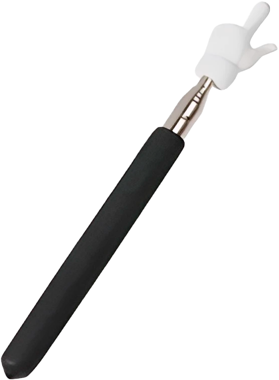

# 👆 ROFL Pointer - Расширение для Chrome

## 🎯 О проекте

ROFL Pointer - это забавное расширение для Chrome, вдохновленное вирусным TikTok-мемом "Указка с пальцем". Расширение превращает ваш обычный курсор в эпичный указательный палец, который не только выглядит круто, но и издает звуки при нажатии!

Проект является Chrome-версией веб-приложения [@unrealstuffs/rofl-pointer](https://unrealstuffs.github.io/rofl-pointer/), адаптированного для использования в качестве браузерного расширения.

## ✨ Особенности

- 🖱️ Кастомный курсор в виде указательного пальца
- 🔄 Анимация поворота при клике
- 🔊 Два типа звуковых эффектов:
  - Мгновенный звук при клике
  - Зацикленный звук при удержании
- 💫 Плавные анимации
- ⚡ Мгновенное включение/выключение через popup-меню
- 🎯 Работает на всех(почти) веб-страницах

## 🛠️ Технический стек

- JavaScript (ES6+)
- Chrome Extensions Manifest V3
- HTML5
- CSS3
- Chrome Storage API
- Web Audio API

## 🔧 Использованные технологии

- Chrome Extensions API
- CSS Transforms & Transitions
- Async/Await для работы со звуком
- Event Listeners
- Chrome Message Passing
- Web Accessible Resources

## 📦 Установка

1. Скачайте или клонируйте репозиторий
2. Откройте Chrome и перейдите в `chrome://extensions/`
3. Включите "Режим разработчика" (Developer Mode)
4. Нажмите "Загрузить распакованное расширение" (Load unpacked)
5. Выберите папку `ukazka-tiktok` из скачанного репозитория

## 🎮 Как использовать

1. После установки кликните на иконку расширения в тулбаре Chrome
2. Используйте переключатель для активации/деактивации курсора
3. Наслаждайтесь крутым курсором и звуковыми эффектами!

## 🙏 Благодарности

- Спасибо [@unrealstuffs](https://github.com/unrealstuffs) за оригинальную веб-версию ROFL Pointer
- Создателям мема "Указка с пальцем" из TikTok за вдохновение
- Всем, кто делает интернет веселее! 😄

## 🔨 Разработка

Проект использует стандартные веб-технологии и Chrome Extensions API. Основные файлы:

- `manifest.json` - конфигурация расширения
- `popup.html/js` - интерфейс управления
- `content.js` - основная логика работы курсора
- `styles.css` - стили курсора

## 📝 Лицензия

MIT License - делайте что хотите, просто упомяните автора! 😉

---
*Сделано с ❤️ и большим количеством мемов*
